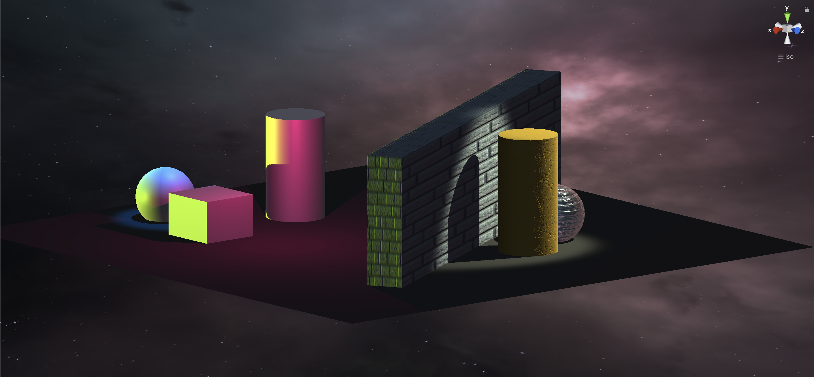

<b>Lab 6: Shading in Unity or Shadertoy</b>

<ol>
    <li>
        <b>Lighting & Lights</b>
        <ul>
            <li>
                <b>Spot</b>
                

                The light from a spotlight shines in a conical manner and illuminates objects based on 
                direction and distance.
                

            </li>
            <li>
                <b>Directional</b>
                

                Directional lights emit parallel rays that travel in a specific direction infinitely. 
                

            </li>
            <li>
                <b>Point</b>
                

                    Point lights shine uniformally in all directions from a single point.
                

            </li>
        </ul>
    </li>
    <li>
        <b>Found Object and Object Recreation</b>
        
        
        
I tried to replicate the body of the bottle in Unity by using the cylinder primitive. I set the 'metallic'
            attribute to 0 since the bottle is almost completely matte and set the 'smoothness' attribute to 0 
            to simulate the textured 'roughness' of the bottle. I also applied a normal map to simulate the scuffs and dents.
        

    </li>
    <li>
        <b>Two Objects</b>
        
I created the two objects by using a cement texture on the metallic sphere and a brick texture on the prism. I 
            sourced the textures from the website suggested in lab4.
        

    </li>
    <li>
        <b>Skybox</b>
        

            I created the skybox by sourcing a series of sky textures from the Unity asset store. I also adjusted
            the lighting color to make the scene appear as if it were night. 
        

    </li>
</ol>

