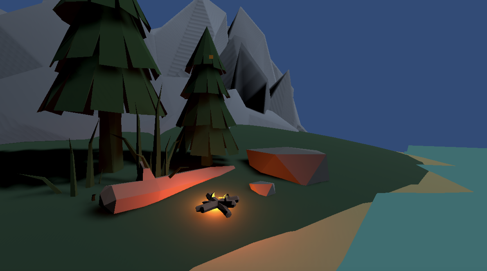

<b>Lab 7: Mesh Manipulation</b>
 
<b>Lab Choice: Unity</b>

 
<b>Scene Video Link:</b> https://drive.google.com/file/d/1RnEZLI30qqLXUi9qwmpLFDX1aOLP9lku/view?usp=sharing

<b>Description of Scene Creation</b>
<ol>
    <li>
        <b>Mountains</b>
        
The mountains were created by following the mesh manipulation 
            tutorial. The peaks were created by extruding the y-axis of
            the spheres.
        

    </li>
    <li>
        <b>Miscellaneous Decorations</b>
        
The trees, rocks, and sticks were created using a base Unity 
            asset set.
        

    </li>
    <li>
        <b>Campfire</b>
        
The dying campfire was created by arranging the 'stick' models
            in a campfire fashion. I used a point light to emulate the glow
            of the fire at the heart of the fire and used a particle system
            to simulate embers. The glow of the embers was created by
            assigning a 'point light' attribute to each particle created.
        

    </li>
    <li>
        <b>Waves</b>
        
The waves were created by following the tutorial described
            in the lab. In the editor, I slowed the wave flow down and lowered
            the intensity so that it simulated the gentle ebb of the ocean.
        

    </li>
</ol>

