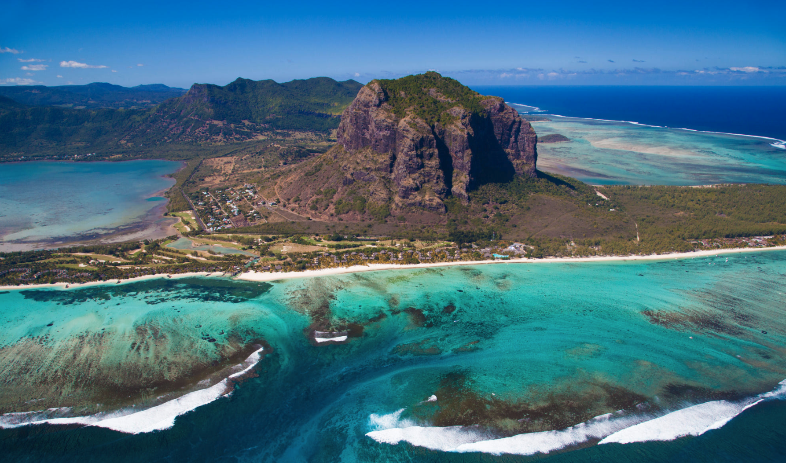
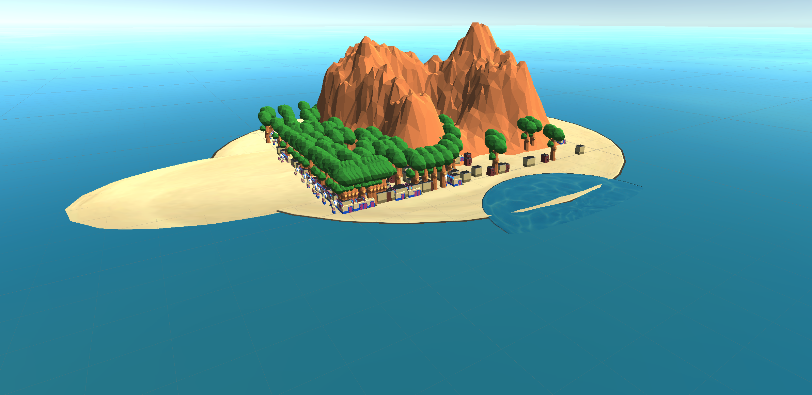

<b>Lab 8: Procedural City Generation</b>
 
Project Choice: Unity (part 1)
 

 

 I had my populating algorithm weighted so that the city would populate more heavily towards one corner. In the image, the man-made structures are clustered at the base of the rock formation, so I likened the edge of my tile to the edge of the island and allowed the buildings to more densely occupy the map in this area.

 
<b>Partner Work</b>
 

For this lab, I tried messaging my partner on Discord to show them my progress even if I wasn't finished. I didn't actually get a response.

